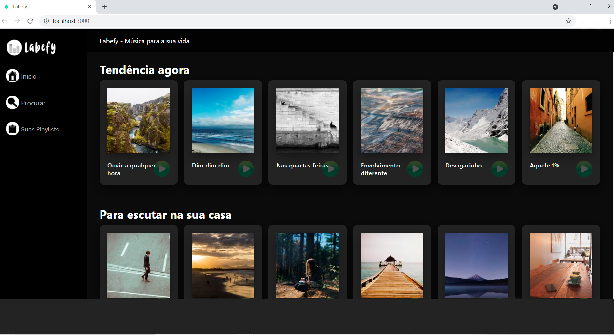

<h2 align="center">Labefy</h2>


  
<hr/>


## ⚙️ Tecnologias Usadas:
- CSS3
- JavaScript 
- React Js 
- React Components
- Styled Components

## ⚙️ Estrutura do Projeto

- Arquivo `.gitignore`
- Arquivo `package.json`
- Arquivo `package-lock.json`
- Pasta `node_modules`: Armazena os pacotes das dependências que definimos no arquivo package.json. Também deve ser observado que este diretório é definido dentro de .gitignore para que todas as dependências infinitas não sejam carregadas para o repositório Git. Portanto, quem baixar o projeto instalará as dependências [diretamente da web](https://www.npmjs.com/)
- Pasta `public`: Ele contém os arquivos estáticos que nos permitirão montar o aplicativo.
- Pasta `src` (source): A pasta src é a pasta onde nosso código React está localizado.

## ⚙️ Explicação da Aplicação

O aplicativo possui 4 componentes:


## ⚙️ Pasta src ou Source:

- Arquivo Index.js:
O conteúdo do arquivo index.js tem as seguintes funcionalidades:

*Linha 1:* importa o módulo React que, como vimos, está  dentro do arquivo package.json e nos permitirá criar interfaces.

*Linha 2:* importa o módulo React-dom, o qual também encontra-se dentro do arquivo package.json, que nos permitirá criar interfaces para o navegador / web.

*Linha 3:* consiste da importação do arquivo index.css.

*Linha 4:* temos a importação de App que está chamando o arquivo App.js no diretório src.

*Linha 6:* linha usada pelo React, que adiciona o código que falta ao documento HTML (a imagem, o parágrafo e o link). O que ReactDOM.render realmente faz (que eu quero pintar, onde eu quero pintá-lo) é adicionar um componente dentro do elemento do elemento com id "root" de index.html usando a instrução JavaScript document.getElementById ("root") .

- Arquivo App.js: é o componente pai da nossa aplicação. Nele estarão a maioria das funções que permitem a funcionalidade de nossa aplicação, ele passará propriedades aos componentes filhos.


##  Instalação


## 🏁 Para rodar o projeto:

Clone este repositório em sua máquina:

```bash
$ git clone https://github.com/future4code/
```

cd `` e rode:

```bash
npm install
```

```bash
npm install styled-components
```

para iniciar:

```bash
npm run start
```


<br/>

##  Conclusão

Este projeto Labefy corresponde ao Módulo 5 do curso Labenu, onde iniciamos a exploração da biblioteca React.
No final do projeto tentamos usar e praticar todo o conteúdo visto em cada sessão da aula:

- Ciclo de vida dos componentes
- Coerção de tipos não Javascript
- Ternário
- Curto circuito
- Renderização condicional
- Armazenamento local
- Técnicas de depuração e hardware

É importante mencionar que também procuramos colocar em prática técnicas, códigos e conselhos encontrados na documentação e na web. Ainda há muito por andar, mas no geral ficamos felizes com o resultado, sem mais ao momento,

Atenciosamente,

Gremis Tovar.


P.D. Um protótipo deste aplicativo (MVP - Produto Mínimo Viável) pode ser visto no seguinte endereço:

http://labefy-gremis.surge.sh/